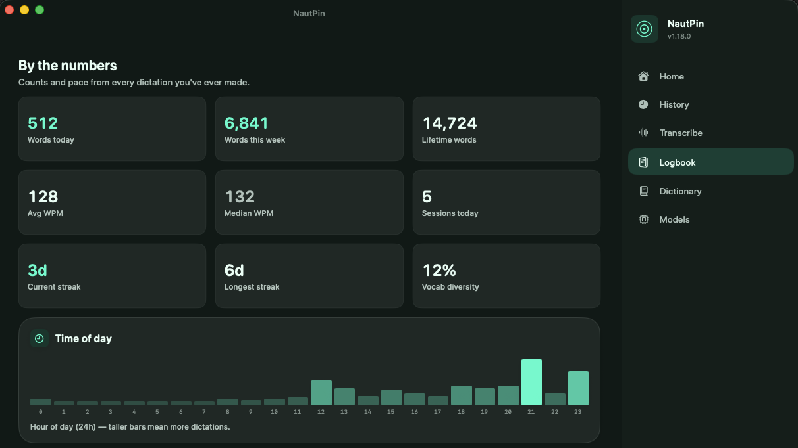
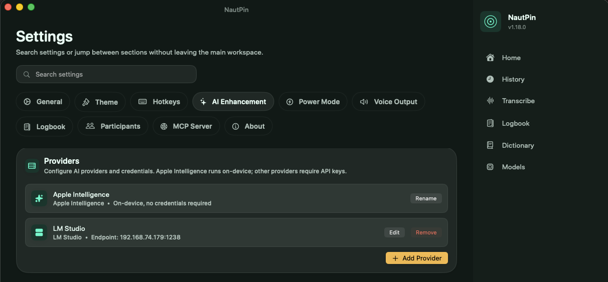

# NautPin 🪐

> A fully private, fully local voice stack for macOS. Faster than Wispr Flow. Free forever.

[](http://cosmos.tail138398.ts.net:3000/48Nauts/NautPin)
[](LICENSE)
[](https://www.apple.com/macos/)
[](https://swift.org/)
[](https://github.com/watzon/pindrop)

**NautPin** is a macOS menu-bar app that takes voice dictation seriously and refuses to give your audio to the cloud. Dictate into any app with hotkey-driven speech-to-text. Get your transcripts cleaned up by a local LLM. Have responses read back to you in a Kokoro voice. See yourself in the **Logbook** — words per minute, vocabulary, topic clusters, stress signals, language register, sentence-opener tics. All on this Mac. None of it on the internet.



It is a fork of Chris Watson's excellent [Pindrop](https://github.com/watzon/pindrop), with these meaningful additions:

| Addition | What it does |
|---|---|
| **Kokoro voice output** | HTTP integration with [Kokoro-FastAPI](https://github.com/remsky/Kokoro-FastAPI) — open-weights TTS that sounds dramatically better than `say` |
| **Local LLM cleanup** | Configurable OpenAI-compatible endpoint, so [LM Studio](https://lmstudio.ai) / Ollama / etc. handle transcript cleanup with no cloud calls |
| **Power Mode profiles** | Per-app and per-URL profiles that swap your prompt preset and AI model based on what app you're dictating into |
| **Logbook** | Personal voice analytics dashboard: WPM, vocabulary diversity, pet phrases, sentence openers, language register, stress signals, LLM-driven topic clusters |
| **Read selected text** | Global hotkey that pipes any highlighted text to Kokoro and speaks it aloud |
| **48Nauts identity** | Neon-mint house theme, NautPin branding throughout, side-by-side installable alongside upstream Pindrop |

---

## Why this exists

Every paid voice product sends your audio across the public internet to someone else's servers. Your voice is biometric — you can't change it, and once it's logged it's logged. Wispr Flow. Whisper Flow. ChatGPT voice mode. Apple's "enhanced" dictation. All of them.

NautPin's wager is that the components to do this on your own Mac already exist, they're free, and they're good enough that the cloud versions stop feeling necessary. WhisperKit for speech-to-text, Kokoro for text-to-speech, LM Studio or Ollama for cleanup, and Power Mode profiles to make it context-aware. The result is faster than the paid versions, costs nothing per month, and nothing ever leaves the machine.

Full write-up: see the companion blog post under `marketing/` in our content pipeline.

---

## The voice loop

```
You press a hotkey, talk
  ↓
NautPin captures the mic → WhisperKit (on-device) transcribes
  ↓
Local LLM cleans up the transcript
  ↓
Text is typed at your cursor in whatever app is focused
  ↓
(Optional) Highlight any text + press the read-aloud hotkey
  ↓
Kokoro speaks it back over your speakers
```

Combined with the Claude Code Stop-hook we publish separately, this becomes a hands-free conversation loop with any AI assistant — speech in, speech out, none of it crossing the public internet.

---

## Features

**Transcription**
- 100% on-device via WhisperKit (Whisper variants) or FluidAudio (Parakeet variants)
- Multiple model sizes from `whisper-base.en` (~140 MB) up to `parakeet-tdt-0.6b-v3-european` (~600 MB, multilingual: EN, DE, ES, FR, IT, NL, PT, TR)
- Global hotkeys: toggle, push-to-talk, copy-last, quick-capture, read-selected
- Custom dictionary for names, jargon, technical vocabulary
- Direct text insertion at cursor (when Accessibility granted) or clipboard fallback

**Cleanup**
- Optional AI enhancement via OpenAI-compatible endpoint (LM Studio, Ollama, or any cloud provider)
- Apple Foundation Models support for fully on-device cleanup
- Custom prompt presets per use case
- Streaming refinement with incremental updates

**Voice output (Kokoro)**
- 50+ voices via local Kokoro-FastAPI container, multilingual
- Configurable per-language defaults
- Global hotkey to read highlighted text aloud
- Sub-second latency on Apple Silicon

**Power Mode**
- Profiles match by app bundle ID and URL pattern
- Override the AI model and prompt preset per profile
- Active profile shown in the menu bar
- Useful for "Slack DE casual," "Terminal terse," "Email formal," etc.

**Logbook (NautPin-exclusive)**
- KPIs: words today/week/lifetime, WPM (avg and median), session counts, vocab diversity, streaks
- Time-of-day and day-of-week heatmaps
- Top target-app distribution
- Pet phrases (1-3 word combos) and sentence openers
- Question-vs-statement rate
- LLM-driven topic clusters from the past week's transcripts
- Wellbeing baseline (text-signal stress detection: filler density, sentence length, exclamations)
- Language register donut chart (polite / neutral / sweary)

**Built on**
- Swift 5.9+, SwiftUI, SwiftData, AVFoundation
- WhisperKit (Argmax) for on-device Whisper
- FluidAudio for Parakeet
- Kokoro-FastAPI (Docker) for TTS
- Sparkle for updates
- Carbon hotkey APIs for global shortcuts

---

## Requirements

- macOS 14.0 (Sonoma) or later
- Apple Silicon (M1 or newer) strongly recommended
- Optional: Docker Desktop (for running Kokoro locally)
- Optional: LM Studio or Ollama (for local LLM cleanup)
- Microphone permission (required for recording)
- Accessibility permission (optional, enables direct text insertion)

---

## Installation

### Pre-built DMG (recommended)
1. Download `NautPin.dmg` from the [releases page](https://github.com/48Nauts-Operator/NautPin/releases)
2. Open the DMG and drag NautPin to `/Applications`
3. Launch NautPin
4. Grant microphone and accessibility permissions when prompted

### Build from source
```bash
git clone http://cosmos.tail138398.ts.net:3000/48Nauts/NautPin.git
cd NautPin
just build
cp -R DerivedData/Build/Products/Debug/Pindrop.app /Applications/NautPin.app
```

(The bundle is still named `Pindrop.app` internally; the user-facing identity is NautPin via `CFBundleDisplayName` and `CFBundleName`.)

### Optional: Kokoro voice output
```bash
docker run -d --name kokoro --restart unless-stopped \
  -p 8880:8880 \
  ghcr.io/remsky/kokoro-fastapi-cpu:latest
```

Verify: `curl http://127.0.0.1:8880/v1/audio/voices` should list 50+ voices.

Then in NautPin → Settings → Voice Output, set the Kokoro server URL and default voice.

### Optional: Local LLM for cleanup
Install [LM Studio](https://lmstudio.ai), load a model (e.g. `gemma-4-e4b-it-obliterated` or `qwen2.5-7b-instruct`), and start the developer-mode API server. Then in NautPin → Settings → AI Enhancement, add a custom OpenAI-compatible provider pointing at `http://127.0.0.1:1234/v1` (or whichever port).



---

## Quick start

1. Press your toggle hotkey (default `Option+Space`)
2. Speak
3. Press the hotkey again
4. Cleaned text appears at your cursor
5. Open Logbook (menu bar → Open Logbook, or `⌘L`) to see yourself

---

## Building

This project uses [`just`](https://github.com/casey/just) for build automation. Install with `brew install just`.

```bash
just build                 # Debug build (signed)
just build-unsigned        # Debug build (unsigned)
just build-release         # Release build
just dmg                   # Signed DMG for distribution
just dmg-self-signed       # Self-signed DMG (fallback)
just test                  # Run tests
just clean                 # Clean build artifacts
just --list                # All available commands
```

See [BUILD.md](BUILD.md) for full build documentation.

---

## Releasing

NautPin releases are published manually from a local machine. See [RELEASING.md](RELEASING.md) for the full flow.

```bash
just release 1.0.0
```

This runs the test suite, builds a signed and notarized DMG, generates the Sparkle appcast, creates a tag, pushes, and publishes a release on Forgejo. A separate workflow mirrors the tagged release to GitHub.

---

## Repository layout

| Path | What's there |
|---|---|
| `Pindrop/` | App source (Swift). Folder is named `Pindrop/` for historical reasons; the product is NautPin. |
| `Pindrop/Services/` | AudioRecorder, TranscriptionService, AI enhancement, Power Mode, Voice Output, Logbook analytics |
| `Pindrop/UI/` | SwiftUI views — Main window, Settings, Logbook, theme system, status bar |
| `Pindrop/UI/Logbook/` | Personal voice-stats dashboard |
| `Pindrop/Models/` | SwiftData models — TranscriptionRecord and friends |
| `Pindrop/Localization/` | xcstrings catalogs (EN, DE, more) |
| `Localization/` | YAML-first source of truth for the localization pipeline |
| `.forgejo/workflows/` | Forgejo Actions — CI, GitHub mirror |
| `justfile` | Build/release recipes |

---

## Contributing

See [CONTRIBUTING.md](CONTRIBUTING.md). The short version: open an issue first if it's non-trivial, follow the existing patterns, run `just build && just test` before opening a PR.

---

## Acknowledgments

NautPin would not exist without [Chris Watson's Pindrop](https://github.com/watzon/pindrop). The dictation core, the menu-bar architecture, the AI Enhancement plumbing, and the bulk of the SwiftUI surface are upstream's work. Our additions sit on top of his foundation.

Other open-source projects this depends on:

- [WhisperKit](https://github.com/argmaxinc/WhisperKit) — Apple-optimized Whisper inference
- [FluidAudio](https://github.com/FluidInference/FluidAudio) — Parakeet on Apple Silicon
- [Kokoro-FastAPI](https://github.com/remsky/Kokoro-FastAPI) — Dockerized TTS server (used over HTTP, not bundled)
- [Sparkle](https://sparkle-project.org/) — Native macOS update framework

---

## License

MIT, inherited from upstream Pindrop. See [LICENSE](LICENSE).

NautPin-specific additions are also MIT-licensed. Contributions are welcome under the same terms.

---

*Made with stubborn local-first conviction by [48Nauts](https://48nauts.com).*
